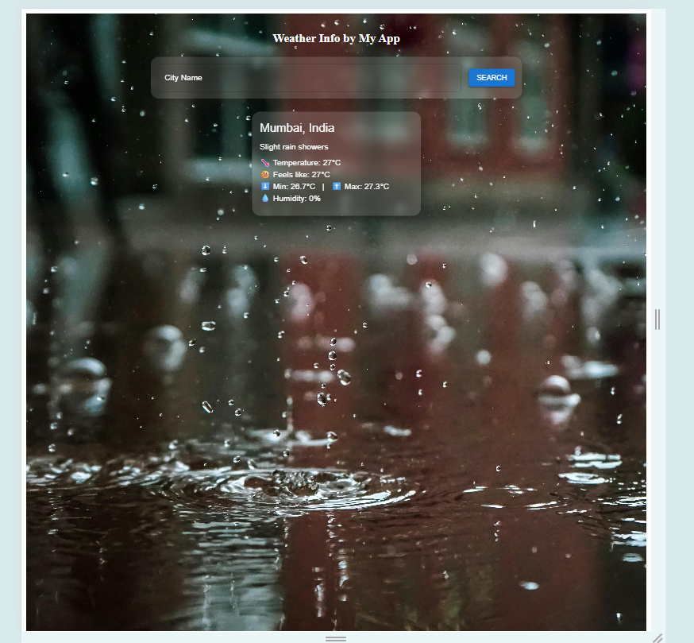

Weather Now 🌦️
A sleek and responsive weather application built with React and Vite. It provides real-time weather data for any city, featuring a dynamic UI that adapts to the current conditions for a beautiful and intuitive user experience.
The goal was to build a clean, modern weather dashboard that solves a simple problem: getting essential weather information

Key Features:

  >>City-Based Weather Search: Instantly fetch current weather data for any city in the world.

  >>Comprehensive Data Display: Shows all the essential information:
   ->Current Temperature
   ->Maximum Temperature
   ->Minimum Temperature
   ->Weather Conditions:(Clear,Cloudy,Rainy,Snow,Thunderstorm)
   ->Humidity Percentage

   >>Weather-Based Backgrounds:The background image dynamically updates to reflect the live weather conditions of the searched city.

   >>Adaptive UI:Text and UI components automatically adjust their colors based on the background image to remain visible in all scenarios.

   >>Smooth Transitions: A subtle cross-fade effect ensures a smooth transition between background images.

   >>Responsive Design:The application is fully responsive and provides optimal viewing experience on all desktop and mobile devices.

   >>State Mangement:This project uses React's built-in useState hook to manage all application state.

Technology Stack:

  >>Framework Used:React JS

  >>Styling: Use Plain CSS for styling purpose.

  >>Weather Data API: Used an Open Meteo Api(a free source) for weather casting purpose.

  >>Geocoding: Uses an integrated geocoding API to convert city names into geographical coordinates for the weather lookup.

 Application Flow
  >>The user enters a city name into the SearchPanel component and submits the search.

  >>The SearchPanel component handles the asynchronous API call to fetch the corresponding weather data.

  >>Upon receiving a successful result, SearchPanel calls the updateInfo function, which was passed down as a prop from its parent, WeatherApp. This sends the new data up to the parent.

  >>The updateInfo function in WeatherApp updates the weatherinfo state, which triggers a re-render of the component.

  >>During the re-render, the new weatherinfo state is passed down as a prop to the InfoBox component, which then displays the updated weather details to the user.

  
# React + Vite

This template provides a minimal setup to get React working in Vite with HMR and some ESLint rules.

Currently, two official plugins are available:

- [@vitejs/plugin-react](https://github.com/vitejs/vite-plugin-react/blob/main/packages/plugin-react/README.md) uses [Babel](https://babeljs.io/) for Fast Refresh
- [@vitejs/plugin-react-swc](https://github.com/vitejs/vite-plugin-react-swc) uses [SWC](https://swc.rs/) for Fast Refresh
